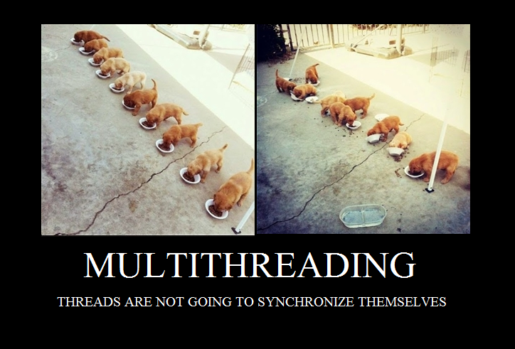

# Espera amb Wait

[ENUNCIAT](https://drive.google.com/file/d/1bSs_J3MTGCBnwk-vCZE4GtIIbJ8sHGno/view)

## Preguntes teòriques
### Perquè s'atura l'execució al cap d'un temps?

### Que passaria si enlloc de una probabilitat de 50/50 fos de 70/30 i 30/70?

### Perquè creus que fa falta la llista i no valdria només amb una variable sencera de reserves?